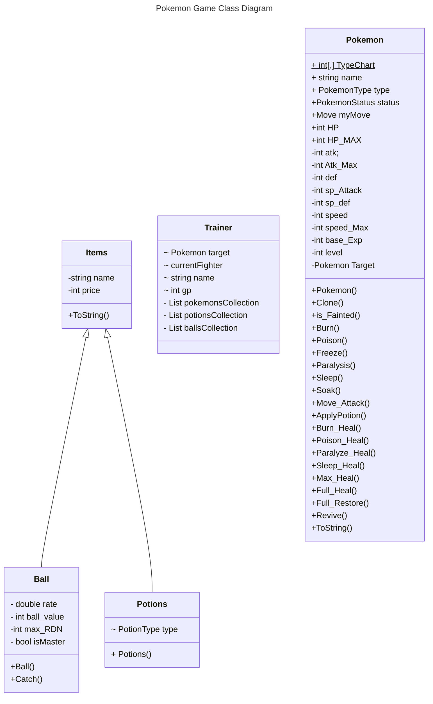

```mermaid
---
title: Pokemon Game Class Diagram
---
classDiagram
Items<|-- Ball
Items<|--Potions
Items: -string name
Items: -int price
Items: +ToString()
class Ball{
        - double rate
        - int ball_value
        -int max_RDN
        - bool isMaster
        +Ball()
        +Catch()
    }
class Potions{
       ~ PotionType type
       + Potions()
    }
class Trainer{
        ~ Pokemon target
        ~ currentFighter
        ~ string name
        ~ int gp
        - List<Pokemon> pokemonsCollection
        - List<Potions> potionsCollection
        - List<Ball> ballsCollection

        
}
class Pokemon{
        + int[,] TypeChart$
        + string name
        + PokemonType type
        +PokemonStatus status
        +Move myMove
        +int HP
        +int HP_MAX
        -int atk;
        -int Atk_Max
        -int def
        -int sp_Attack
        -int sp_def
        -int speed
        -int speed_Max
        -int base_Exp
        -int level
        -Pokemon Target
        +Pokemon()
        +Clone()
        +is_Fainted()
        +Burn()
        +Poison()
        +Freeze()
        +Paralysis()
        +Sleep()
        +Soak()
        +Move_Attack()
        +ApplyPotion()
        +Burn_Heal()
        +Poison_Heal()
        +Paralyze_Heal()
        +Sleep_Heal()
        +Max_Heal()
        +Full_Heal()
        +Full_Restore()
        +Revive()
        +ToString()
        
}


```
