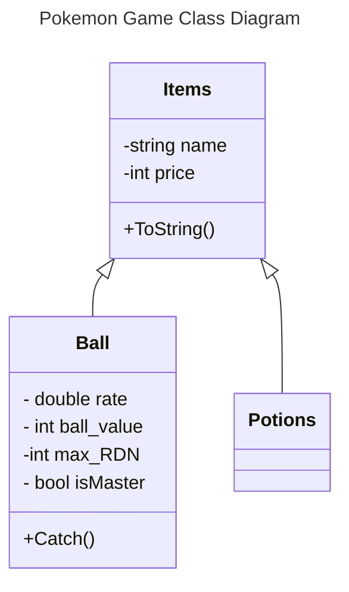

```mermaid
---
title: Pokemon Game Class Diagram
---
classDiagram
Items<|-- Ball
Items<|--Potions
Items: -string name
Items: -int price
Items: +ToString()
class Ball{
        - double rate
        - int ball_value
        -int max_RDN
        - bool isMaster
        +Catch()
    }


```
