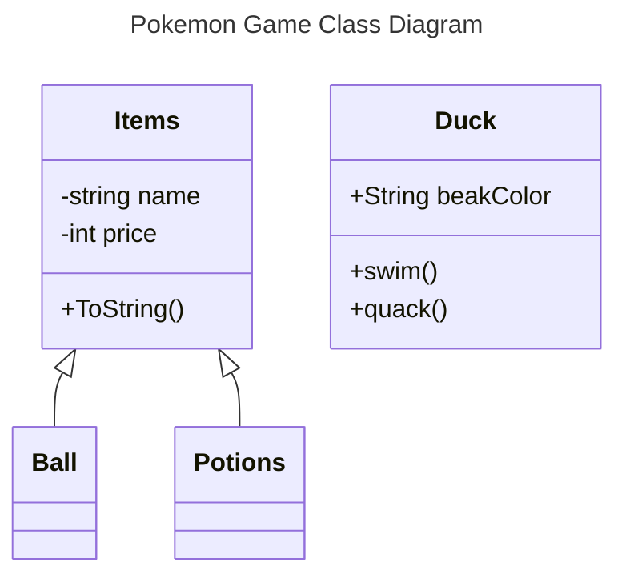

```mermaid
---
title: Pokemon Game Class Diagram
---
classDiagram
Items<|-- Ball
Items<|--Potions
Items: -string name
Items: -int price
Items: +ToString()
class Duck{
        +String beakColor
        +swim()
        +quack()
    }


```
